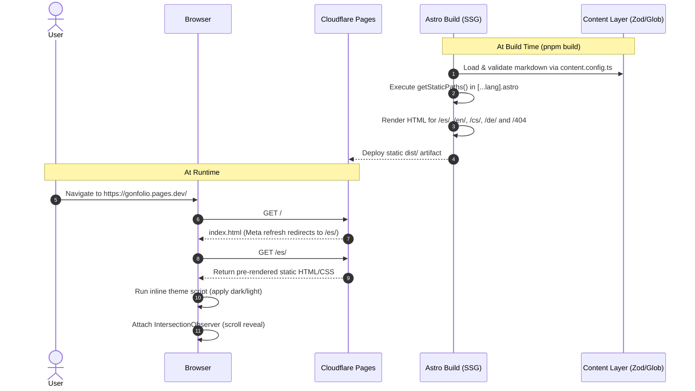

# Architecture & Data Flow

## Workspace Structure

The project follows a clean, modular Astro repository structure. Absolute path aliases are configured in [`tsconfig.json`](file:///c:/gon-sudo/DEVEL/Gonfolio/tsconfig.json) so any file in `src/` can be imported directly (e.g. `import Layout from "layouts/Layout.astro"`).

```
Gonfolio/
├── docs/                        # Complete codebase documentation
├── public/                      # Static assets served at root (favicon, logo)
├── src/
│   ├── assets/                  # Local media assets (photo.avif)
│   ├── components/              # Section & atomic UI components
│   │   ├── icons/               # 34 standalone SVG icon components
│   │   ├── ChangeLang.astro     # Language switcher
│   │   ├── Contact.astro        # Contact section & interactive form
│   │   ├── Experience.astro     # Timeline & career stats
│   │   ├── Footer.astro         # Footer, bonfire animation & back-to-top
│   │   ├── Header.astro         # Top profile header & social links
│   │   ├── Navigation.astro     # Sticky navigation & scroll handler
│   │   ├── Profile.astro        # Hero bio & CTA buttons
│   │   ├── Projects.astro       # Project gallery & technology badges
│   │   ├── Skills.astro         # Categorized skills grid
│   │   ├── ToggleDarkLight.astro# Theme switcher modal & logic
│   │   └── _SEO.astro           # Meta, Open Graph, Twitter tags
│   ├── content/                 # Localized content markdown & image files
│   │   ├── cs-profile/          # Czech profile entry
│   │   ├── cs-projects/         # Czech project entries
│   │   ├── de-profile/          # German profile entry
│   │   ├── de-projects/         # German project entries
│   │   ├── en-profile/          # English profile entry
│   │   ├── en-projects/         # English project entries
│   │   ├── es-profile/          # Spanish profile entry
│   │   └── es-projects/         # Spanish project entries
│   ├── i18n/                    # Localization system
│   │   ├── ui.ts                # Translation dictionaries
│   │   └── utils.ts             # Translation helper functions
│   ├── layouts/                 # Root HTML shell
│   │   └── Layout.astro         # Theme provider, font loader, scroll reveal
│   ├── pages/                   # Page routes
│   │   ├── 404.astro            # 404 Not Found page
│   │   ├── [...lang].astro      # Main localized dynamic page route
│   │   └── index.astro          # Root redirect to default locale (/es/)
│   ├── values/                  # Typed static datasets & constants
│   │   ├── experiences.ts       # Localized experience & stats data
│   │   └── technologies.ts      # Technology name constants
│   ├── content.config.ts        # Content Layer collection schemas & glob loaders
│   └── env.d.ts                 # Astro client types declaration
├── astro.config.mjs             # Astro integration configuration
├── package.json                 # Project dependencies & build scripts
├── tailwind.config.mjs          # Tailwind theme configuration
└── tsconfig.json                # TypeScript configuration & path aliases
```

---

## Build & Request Lifecycle



---

## Component Composition Tree

The page layout assembled in [`src/pages/[...lang].astro`](file:///c:/gon-sudo/DEVEL/Gonfolio/src/pages/[...lang].astro) follows this strict structural tree:

```
Layout.astro
├── <head>
│   ├── _SEO.astro
│   └── <ClientRouter />
├── <body>
│   ├── Radial gradient backdrop
│   ├── ToggleDarkLight.astro
│   ├── <slot>
│   │   ├── Navigation.astro (includes ChangeLang.astro)
│   │   ├── Header.astro (Profile avatar, name, social links)
│   │   ├── Profile.astro (Hero section with bio from Content Layer)
│   │   ├── Experience.astro (Timeline and stats from src/values/experiences.ts)
│   │   ├── Skills.astro (Categorized skill badges with icons)
│   │   ├── Projects.astro (Project cards from Content Layer)
│   │   └── Contact.astro (Contact details and contact form)
│   └── Footer.astro (Bonfire GIF, copyright, back-to-top button)
```

---

## Client-Side Logic & Interactivity

Although the site is statically pre-rendered with zero runtime framework overhead (React/Vue are not hydrated on the client), lightweight vanilla JavaScript script tags handle essential interactions:

1. **Theme Initialization & Switcher** ([`ToggleDarkLight.astro`](file:///c:/gon-sudo/DEVEL/Gonfolio/src/components/ToggleDarkLight.astro)):
   - Runs inline to prevent flash-of-unstyled-content (FOUC).
   - Reads `localStorage.getItem("theme")` or falls back to `window.matchMedia("(prefers-color-scheme: dark)")`.
   - Modifies `document.documentElement.classList.toggle("dark")`.
2. **Scroll Direction Detection** ([`Navigation.astro`](file:///c:/gon-sudo/DEVEL/Gonfolio/src/components/Navigation.astro)):
   - Compares `window.pageYOffset` against previous scroll position.
   - Hides navigation on scroll down (`translate-y-[-100%]`) and restores it on scroll up.
3. **Scroll Reveal Animations** ([`Layout.astro`](file:///c:/gon-sudo/DEVEL/Gonfolio/src/layouts/Layout.astro)):
   - An `IntersectionObserver` observes all elements with the `.reveal` class and attaches `.active` when in viewport.
4. **Smooth Anchor Scrolling** ([`Navigation.astro`](file:///c:/gon-sudo/DEVEL/Gonfolio/src/components/Navigation.astro)):
   - Smoothly scrolls to target anchor sections (`#about`, `#skills`, `#projects`, `#contact`).
5. **Back-to-Top Button** ([`Footer.astro`](file:///c:/gon-sudo/DEVEL/Gonfolio/src/components/Footer.astro)):
   - Dynamically toggles visibility when scrolled past 300px and executes `window.scrollTo({ top: 0, behavior: "smooth" })`.
