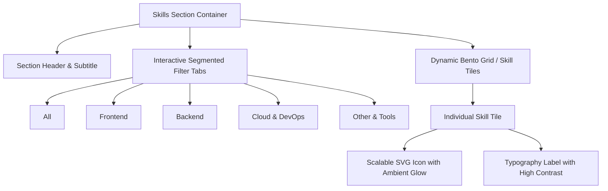

# Skills Section: UX/UI Analysis & Modernization Strategy

## Executive Summary

An audit of the **Skills & Technologies** section ([`src/components/Skills.astro`](file:///c:/gon-sudo/DEVEL/Gonfolio/src/components/Skills.astro)) on mobile viewports reveals significant UX friction points, vertical bloat, visual repetition, and layout collisions. This document details the UX/UI evaluation and outlines the proposed modernization strategy.

---

## Current UX/UI Friction Points

### 1. Excessive Vertical Scroll & Space Consumption
- **Issue**: On mobile viewports (360px–414px width), the current design stacks 4 large monolithic container boxes vertically.
- **Impact**: The section spans over **1,500px in height** (equivalent to 2.5–3 full mobile screen heights). Users must perform multiple consecutive swipe gestures just to reach the subsequent **Projects** section.

### 2. 2-Column Grid Imbalances & Orphan Elements
- **Issue**: The current mobile grid uses `grid-cols-2 sm:grid-cols-3 gap-6`.
- **Impact**: Categories with odd numbers of items (e.g., "Otras Tecnologías" with 3 items: Java, C#/.NET, Python) leave an empty gap in the second column on the second row, degrading visual balance.

### 3. Redundant Skills & Inconsistent Categorization
- **Issue**: `TypeScript` is duplicated—it appears in both **Frontend Development** and **Backend & APIs**.
- **Impact**: Diminishes perceived technical rigor and consumes unnecessary grid real estate.

### 4. Collision with Fixed Theme Toggle Button
- **Issue**: The floating theme switcher (`ToggleDarkLight.astro`) is pinned to the bottom-right (`fixed bottom-0 right-0 z-20 size-16`).
- **Impact**: On narrow mobile screens, this floating control directly overlaps and obscures the bottom-right skill cards and labels (e.g., Next.js, SQL Server, Python).

### 5. Touch & Mobile Interactivity Limitations
- **Issue**: Icon transformations (`group-hover:scale-110`, `group-hover:rotate-6`) and ambient glows (`opacity-0 group-hover:opacity-100`) depend entirely on `:hover` pseudo-classes.
- **Impact**: Touch devices lack natural mouse hover, causing either missed visual feedback or sticky hover states upon tapping.

---

## Comparative Layout Matrix (Before vs. Proposed)

| Dimension | Current Implementation | Proposed Modernized Implementation |
| :--- | :--- | :--- |
| **Mobile Height** | ~1,500px–1,800px (excessive) | ~400px–550px (compact & focused) |
| **Navigation Pattern** | Monolithic vertical stack | Interactive Segmented Filter Pills (`All`, `Frontend`, `Backend`, `Cloud`, `Other`) |
| **Mobile Grid** | 2 columns (`grid-cols-2`) with large gaps | 3–4 columns (`grid-cols-3 sm:grid-cols-4 md:grid-cols-6`) with optimized density |
| **Skill Duplication** | `TypeScript` listed twice | Normalized: single definitive categorization per skill + balanced sets |
| **Fixed UI Collision** | Theme toggle overlaps bottom-right cards | Safe margin offsets and compact grid prevent floating overlap |
| **Touch Feedback** | Hover-only CSS | Active touch states (`active:scale-95`), smooth category transitions |

---

## Proposed UI/UX Architecture

### Key Enhancements

1. **Interactive Category Tabs (Pills)**:
   - High-contrast pill buttons (`All`, `Frontend`, `Backend`, `Cloud & DevOps`, `Other / Tools`).
   - Smooth animated active pill indicator with ambient orange/amber accent.
   - Allows recruiters and hiring managers to immediately isolate the tech stack relevant to their role.

2. **Refined Tile Design (Glassmorphism & Micro-Interactions)**:
   - Compact cards with subtle borders (`border-yellow-500/20 dark:border-yellow-500/10`), rounded corners (`rounded-xl`), and dark glass background (`bg-white/60 dark:bg-zinc-900/40 backdrop-blur-sm`).
   - Sizing optimized for finger tap targets (minimum 48px touch targets).

3. **Data Normalization & Icon Balance**:
   - Remove duplicate `TypeScript` from Backend and use `Node.js`, `NestJS`, `Next.js`, `Java Spring`, `GraphQL`.
   - Incorporate `Figma` (`FigmaIcon.astro`) into "Other Technologies & Tools" to form a balanced 4-item set (Java, C#/.NET, Python, Figma).
