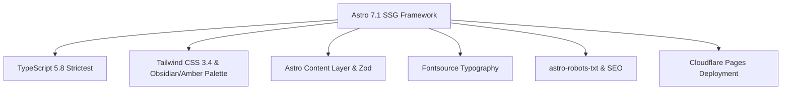

# System Overview

## Purpose & Scope

**Gonfolio** is the professional personal brand and portfolio website of **Flavio Oré**, a **Full-Stack Software Engineer**. The platform is engineered to build authority, trust, and business opportunities by showcasing production-grade operational systems, ERPs, business process automations, and scalable cloud microservices.

The project is architected for maximum performance, clean visual aesthetics, search engine visibility (SEO), and accessible multilingual content delivery.

---

## High-Level Capabilities

1. **Brand Authority & Value Positioning**: Positions engineering capabilities across operational systems (ERPs, inventory Kardex, billing), business workflow automations, and full-stack microservices (React, Angular, NestJS, Spring Boot, AWS).
2. **Multilingual Architecture**: Fully localized support for 4 languages:
   - 🇪🇸 Spanish (`es` - default language)
   - 🇺🇸 English (`en`)
   - 🇨🇿 Czech (`cs`)
   - 🇩🇪 German (`de`)
3. **Static Site Generation (SSG)**: Zero-server runtime overhead. Pages are pre-rendered at build time with Astro 7.
4. **Strict Content Layer Validation**: Type-safe Markdown content collections driven by Zod schemas for biographical data and project case studies.
5. **Adaptive Theme Engine**: Client-side theme switcher supporting `Light`, `Dark`, and `System` preference with localStorage persistence and CSS transition smoothing.
6. **High-Conversion Contact Hub**: One-click email copy to clipboard with toast confirmation, direct verified social channels, and a 24-hour response guarantee.
7. **SEO & Social Optimization**: Built-in Open Graph metadata, Twitter Cards, auto-generated `robots.txt`, and canonical link tags.

---

## Technology Stack

### Core Technologies

| Layer                    | Technology                                                                                   | Version   | Purpose                                                  |
| :----------------------- | :------------------------------------------------------------------------------------------- | :-------- | :------------------------------------------------------- |
| **Framework**            | Astro                                                                                        | `^7.1.0`  | SSG build tool, static templating, and page routing      |
| **Language**             | TypeScript                                                                                   | `^5.8.2`  | Strict type safety and compilation                       |
| **CSS Framework**        | Tailwind CSS                                                                                 | `^3.4.17` | Utility-first responsive design and dark mode styling    |
| **Tailwind Integration** | `@astrojs/tailwind`                                                                          | `^6.0.2`  | Astro official integration for Tailwind                  |
| **Animations**           | `@midudev/tailwind-animations`                                                               | `^0.2.0`  | Keyframe micro-animations and transition presets         |
| **Typography**           | `@fontsource-variable/hanken-grotesk` `@fontsource-variable/inter` `@fontsource/inder` | `^5.3.0`  | Self-hosted variable and static web fonts                |
| **Content Validation**   | Astro Content Collections (`zod`)                                                            | Built-in  | Schema validation and typed frontmatter extraction       |
| **SEO & Robots**         | `astro-robots-txt`                                                                           | `^1.0.0`  | Automatic `robots.txt` generation during build           |
| **Type Checking**        | `@astrojs/check`                                                                             | `^0.9.10` | CLI utility for validating `.astro` and TypeScript files |

---

## Hosting & Deployment Architecture

- **Platform**: Cloudflare Pages
- **Production URL**: `https://gonfolio.pages.dev/`
- **Build Output**: Static HTML, CSS, JS, and optimized image assets generated in the `dist/` directory.
- **Image Processing**: Configured with `passthroughImageService()` in `astro.config.mjs` to ensure fast static asset pipeline without external runtime image servers.
